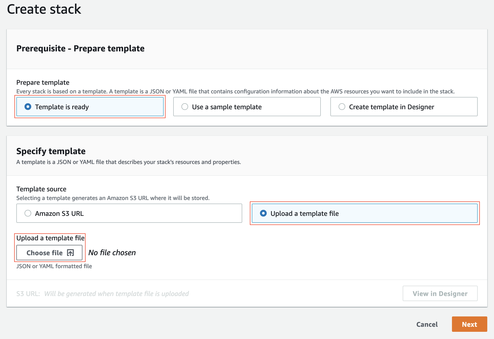
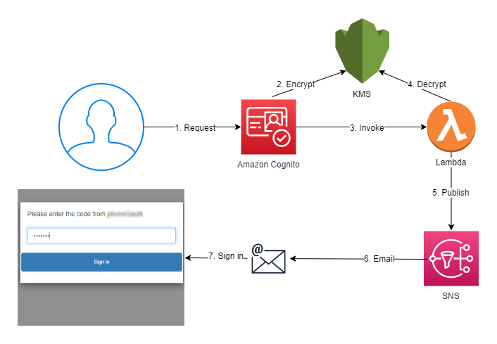
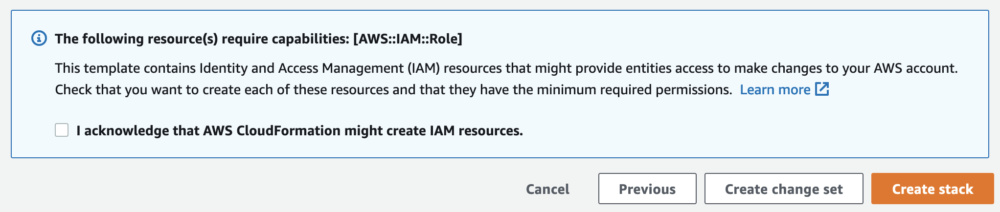
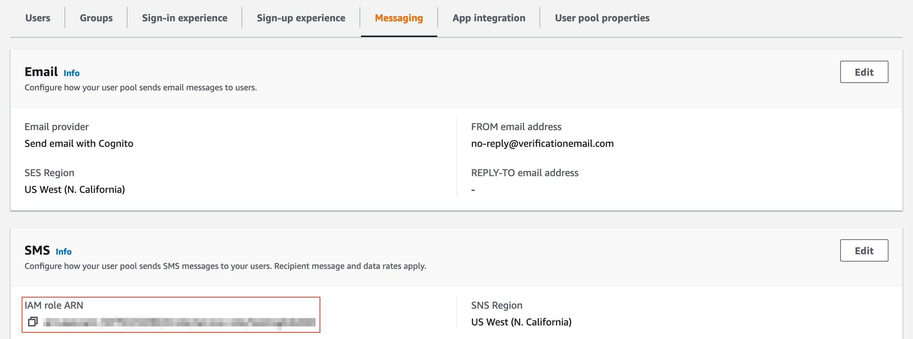

## Amazon Cognito User Pool Development and Testing with SMS Redirected to Email

## Overview
You can use a [Custom SMS sender Lambda trigger](https://docs.aws.amazon.com/cognito/latest/developerguide/user-pool-lambda-custom-sms-sender.html)
to evaluate the SMS capabilities of Amazon Cognito user pool. You can set up a test environment that, instead of sending
SMS messages, sends messages to an email address that you choose.

[To set up SMS messages for the first time in an Amazon Cognito user pool](https://docs.aws.amazon.com/cognito/latest/developerguide/user-pool-sms-settings.html#user-pool-sms-settings-first-time),
you must complete additional setup with Amazon SNS and Amazon PinPoint. Initially, you can’t send SMS messages to US
phone numbers. This requires that you purchase an origination identity through Amazon PinPoint. You also can’t initially
send SMS messages to any phone numbers that you haven’t verified with Amazon SNS. To send SMS messages to unverified
phone numbers, you must submit a support request to exit the SMS sandbox. You also have a low initial spending limit
for SMS messages until you create a support case to increase it. Until you have met these prerequisites, your user pool
is not production-ready for the SMS message capabilities of Amazon Cognito.

You can build a test environment that makes it possible to evaluate the full SMS message capabilities of Amazon Cognito
user pools when you deploy this solution. With a [custom SMS sender Lambda trigger](https://docs.aws.amazon.com/cognito/latest/developerguide/user-pool-lambda-custom-sms-sender.html),
you can send SMS messages using your own custom logic. A user pool might invoke the Custom SMS sender Lambda trigger to
send SMS messages as part of the following actions:

- A user signs up in your user pool with a phone number.
- A user with SMS multi-factor authentication (MFA) signs in.
- A user requests to reset a lost password.
- A user requests a replacement code to reset their password.
- A user updates phone number attribute and Amazon Cognito sends a code to verify the attribute.
- A user creates a phone number attribute and Amazon Cognito sends a code to verify the attribute.
- Administrator creates a new user in your user pool and Amazon Cognito sends a temporary password.

This solution makes it possible to evaluate the messaging capabilities of your user pool with a *CustomSMSSender*
Lambda trigger. Instead of sending SMS messages to users' phone numbers, the Lambda function routes your SMS messages
to an Amazon SNS topic, which can deliver the message to you through email. The SNS topic that you configure sends SMS
messages to its email subscribers. Amazon Cognito doesn’t send any messages to the phone number that your user provides
in this solution. When you deploy this solution, you redirect all SMS messages from your user pool to one or more email
addresses, regardless of any email address or phone number attributes that you configure in the Amazon Cognito user profile.

You can deploy this solution with AWS CloudFormation templates. We provide two templates in this repository:

1. CustomSMSSenderWithNewUserPool
2. CustomSMSSenderWithExistingUserPool

Only use the Amazon Cognito environment that this solution creates for development and testing of an app. After you
complete testing and are ready to use your user pool in production, remove the Custom SMS Sender Lambda trigger
assignment. You must use the UpdateUserPool operation in the AWS API or CLI to remove a Custom SMS Sender Lambda trigger.

## Topics
- [Prerequisites](#prerequisites)
- [Creating stacks](#creating-stacks)
- [The templates](#the-templates)
- [Solution architecture](#solution-architecture)
- [Resources created by the templates](#resources-created-by-the-templates)
- [Deploy the solution](#deploy-the-solution)
- [Evaluate the solution](#evaluate-the-solution)
- [Troubleshooting](#troubleshooting)
- [Notes and security considerations](#notes-and-security-considerations)
- [Cleanup](#cleanup)
- [Contribute](#contribute)
- [License](#license)

## Prerequisites
If you haven't already done so you must first:

- [Create an AWS account](https://aws.amazon.com/blogs/startups/how-to-get-started-on-aws-from-a-dead-standstill/).
- Make sure you're signed into AWS as an [IAM user with admin access](https://docs.aws.amazon.com/IAM/latest/UserGuide/getting-started_create-admin-group.html).
  Don't use the root account!
- [Clone this repo](https://help.github.com/articles/cloning-a-repository/) so that you have a local copy of the templates.

## Creating stacks
Use the AWS [CloudFormation console](https://console.aws.amazon.com/cloudformation/home) to run the templates. Select
the **Create stack** button in the upper right corner of the console, then select **Template is ready**, select **Upload
a template file** and select **Choose file** to find your local fork of this repository and choose the template you want
to run.

## The templates
This sample contains the following CloudFormation templates:

- CustomSMSSenderWithExistingUserPool.json
- CustomSMSSenderWithExistingUserPool.yaml
- CustomSMSSenderWithNewUserPool.json
- CustomSMSSenderWithNewUserPool.yaml

## Solution architecture
The solution architecture discussed in this post is presented below:

The flow of this process is as follows:
1. You make an API request in your user pool that would result in an SMS message being delivered. Common actions that
   generate an SMS message are:
    1. Sign up and verify a phone number.
    2. Sign in with SMS MFA enabled.
    3. Reset a password.
2. The user pool uses a KMS key to encrypt the one-time-use code.
3. The user pool invokes your [Custom SMS sender Lambda trigger](https://docs.aws.amazon.com/cognito/latest/developerguide/user-pool-lambda-custom-sms-sender.html).
4. The Lambda function decrypts the code with the same AWS KMS key that encrypted the code.
5. The Lambda function generates a message that includes the code. It publishes the message to an Amazon SNS topic.
6. The SNS topic sends the message to the email address you subscribed.
7. You provide the code in the API response that completes the request.

## Resources created by the templates

### Resources created by the CloudFormation templates
- Two AWS Lambda functions
    - A Custom SMS Sender trigger Lambda function
    - A helper Lambda function that can:
        - Add and remove the AWS Encryption SDK for the Custom SMS Sender trigger Lambda function.
        - Add and remove the Custom SMS Sender Lambda trigger for a user pool that you provide (**Deploy with an existing user pool** solution only).

- IAM roles
    - A Lambda function execution role for the Custom SMS Sender trigger Lambda function
    - A Lambda function execution role for the helper Lambda function

- An AWS KMS key used by the Lambda function to decrypt the code encrypted by Cognito user pool.

- An Amazon SNS topic with an email subscriber. The subscriber is the email address that you provided to the CloudFormation
  template. You can choose to encrypt your SNS topic when you deploy the CloudFormation stack with another KMS key. Note
  that using a KMS key incurs additional pricing. For more information, see [AWS Key Management Service pricing](https://aws.amazon.com/kms/pricing/).

### Additional resources created by the new user pool template
- An Amazon Cognito user pool
- An Amazon Cognito user pool app client
- An IAM role with sns:Publish permission that Amazon Cognito can use to meet SMS setup requirements

### Resource IDs
|Resource logical ID                                              |Type                                          |Required   |Created with Templates        |
|-----------------------------------------------------------------|----------------------------------------------|-----------|------------------------------|
|CognitoCustomSMSSenderTestingUserPool                            |AWS::Cognito::UserPool                        |Required   |CustomSMSSenderWithNewUserPool|
|CognitoCustomSMSSenderTestingUserPoolAppClient                   |AWS::Cognito::UserPoolClient                  |Required   |CustomSMSSenderWithNewUserPool|
|CognitoCustomSMSSenderTestingUserPoolSMSRole                     |AWS::IAM::Role                                |Required   |CustomSMSSenderWithNewUserPool|
|CognitoCustomSMSSenderTestingLambdaInvocationPermission          |AWS::Lambda::Permission                       |Required   |Both                          |
|CognitoCustomSMSSenderTestingLambda                              |AWS::Lambda::Function                         |Required   |Both                          |
|CognitoCustomSMSSenderTestingLambdaRole                          |AWS::IAM::Role                                |Required   |Both                          |
|CognitoCustomSMSSenderTestingLambdaLogGroup                      |AWS::Logs::LogGroup                           |Required   |Both                          |
|CognitoCustomSMSSenderTestingLambdaHelper                        |AWS::Lambda::Function                         |Required   |Both                          |
|CognitoCustomSMSSenderTestingLambdaHelperRole                    |AWS::IAM::Role                                |Required   |Both                          |
|CognitoCustomSMSSenderTestingLambdaHelperLogGroup                |AWS::Logs::LogGroup                           |Required   |Both                          |
|CognitoCustomSMSSenderTestingLambdaHelperResources               |Custom::CognitoCustomSMSSenderHelperResources |Required   |Both                          |
|CognitoCustomSMSSenderTestingLambdaSNSTopic                      |AWS::SNS::Topic                               |Required   |Both                          |
|CognitoCustomSMSSenderTestingKMSKey                              |AWS::KMS::Key                                 |Required   |Both                          |
|CognitoCustomSMSSenderTestingSNSTopicKMSKey                      |AWS::KMS::Key                                 |Optional   |Both                          |
|CognitoCustomSMSSenderTestingLambdaPolicyOpt(In/Out)SNSEncryption|AWS::IAM::Policy                              |Conditional|Both                          |

## Deploy the solution
### Deploy with a new user pool
1. Launch one of the following two stacks:
    1. CustomSMSSenderWithNewUserPool.json
    2. CustomSMSSenderWithNewUserPool.yaml

2. Provide the following parameters:
    1. A name for the stack that’s fewer than 48 characters long since we attached the stack name to the Lambda function
       name that has a 64-character limit.
    2. A valid email address that you own. All SMS messages from your user pool will be simulated in the form of emails
       to this address.
    3. A Boolean value for OptInSNSTopicEncryptionInput. Choose true if you want to create an additional KMS key and use
       it to encrypt the SNS topic.

3. Choose **Next**, and then choose **Next** again. On the Review page, select the check box that authorizes CloudFormation
   to create AWS Identity and Access Management (IAM) resources for the stack.
   
4. Choose **Create stack** to deploy the stack. The deployment will take several minutes. When the status says
   CREATE_COMPLETE, the deployment is complete.

### Deploy with an existing user pool
1. Choose an existing user pool to modify. Your user pool must be in the same AWS Region where you deploy the stack. It
   must also have an IAM role configured for SMS messages, and an app client.
2. Launch one of the following two stacks:
    1. CustomSMSSenderWithExistingUserPool.json
    2. CustomSMSSenderWithExistingUserPool.yaml
3. Provide the following parameters:
    1. A name for the stack that’s fewer than 48 characters long since we attached the stack name to the Lambda function
       name that has a 64-character limit.
    2. A valid email address that you own. All SMS messages from your user pool will be simulated in the form of emails
       to this address.
    3. The ID of your existing user pool. The user pool must be in the same AWS Region as your stack.
    4. The ARN of the IAM role that your existing user pool uses for SMS messages. You can find the **IAM role ARN**
       in the **Messaging** tab for your user pool in the Amazon Cognito console.
       
    5. A Boolean value for OptInSNSTopicEncryptionInput. Choose true if you want to create an additional KMS key and
       use it to encrypt the SNS topic.
4. Choose **Next**, and then choose **Next** again. On the Review page, select the check box that authorizes CloudFormation
   to create AWS Identity and Access Management (IAM) resources for the stack.
   
5. Choose **Create stack** to deploy the stack. The deployment will take several minutes. When the status says
   CREATE_COMPLETE, the deployment is complete.

## Evaluate the solution
1. You will have received a **Confirm  subscription** message from `no-reply@sns.amazonaws.com` at the email address
   that you provided to the CloudFormation stack. Select the link in the email to confirm your subscription to the
   Amazon SNS topic.
2. Review the SNS topic that you subscribed, named **CognitoCustomSMSSenderTestingLambdaSNSTopic-your stack name** and
   verify that your email address is **Confirmed**.
3. Review the **User pool properties** tab of your user pool. Verify that you have a **Custom SMS Sender Lambda trigger**
   and its attached Lambda function with the name **CogSMSTesting-your stack name**.
4. Review the **App integration** tab of your user pool. Copy the **Client ID** of the app client under
   **App clients and analytics**.
5. Install the [AWS CLI](https://docs.aws.amazon.com/cli/latest/userguide/getting-started-install.html) and run the
   following command to sign up a new user and send an “SMS message”:
   `aws cognito-idp sign-up --client-id [app ID from the previous step] --username [+12065551212] —password [password]`
6. Check the SNS topic subscriber’s email inbox for a message with the subject “Cognito Lambda-based SMS messaging testing stack.”

## Troubleshooting
1. I didn’t receive a code at the email address that I subscribed to the SNS topic.

   Most often, an SNS topic doesn’t deliver an email message because the subscriber hasn’t confirmed their subscription
   to the topic. Review your resource configuration as follows:
    1. Locate your Custom SMS Sender testing stack in the AWS Cloudformation console. Review the
       CognitoCustomSMSSenderTestingSNSTopicSubscriber email address in the **Parameters** tab.
    2. Check your email inbox for a confirmation email for the SNS topic. If you have not already done so, click the
       link in the confirmation email to confirm the subscription. If you subscribed the SNS topic after API requests
       and you could not receive the code, you might need to **Delete** the subscription and **Create subscription**
       again in the Amazon SNS console.
    3. Confirm that Amazon Cognito invoked your custom SMS sender function when you made the API request to evaluate the
       solution. Go to the AWS Cloudformation console and find your stack. Review the **Resources** tab and choose the
       **Physical ID** link to view your CognitoCustomSMSSenderTestingLambda Lambda function. Choose **Monitor**, then
       **View logs in CloudWatch**. From the CloudWatch Logs console, check that logs exist and that the function has
       not logged errors.
    4. The stack creates an additional Lambda function with the resource name CognitoCustomSMSSenderTestingLambdaHelper.
       It imports the AWS Encryption SDK for your custom SMS sender function when the [custom resource](https://docs.aws.amazon.com/AWSCloudFormation/latest/UserGuide/template-custom-resources.html)
       is created. Review CloudWatch logs for the helper function.

   Existing user pool configurations vary. Confirm that you have configured your existing user pool to send SMS messages
   for the events that you want to test.

   If you don’t receive a code from the SignUp API, review the **Sign-up experience** tab of your user pool. Edit
   **Attribute verification and user account confirmation** to set **Allow Cognito to automatically send messages to
   verify and confirm** to **Enabled**, and **Attributes to verify** to include **Send SMS message**. Confirm that you
   provided a phone number for the new user in your testing. If you don’t receive an MFA code, confirm your configuration
   in the **Sign-in experience** tab. Edit **Multi-factor authentication** to set **MFA enforcement** to **Require MFA**,
   and **MFA methods** to include **SMS message**. If you don’t receive a code from the ForgotPassword API, confirm your
   configuration in the **Sign-in experience** tab. Edit **User account recovery** to set **Self-service account recovery**
   to **Enabled**, and include **SMS** as a **Recovery message delivery method**.

2. The CognitoCustomSMSSenderTestingLambdaLayerHelperResources resource gets stuck when I create, update, or delete
   resources.

   The CloudFormation template uses the [AWS Lambda-backed custom resources](https://docs.aws.amazon.com/AWSCloudFormation/latest/UserGuide/template-custom-resources-lambda.html)
   strategy to make the AWS Encryption SDK available to your custom SMS sender Lambda function. The template creates a
   helper Lambda-backed [custom resource](https://docs.aws.amazon.com/AWSCloudFormation/latest/UserGuide/template-custom-resources.html)
   that’s named CognitoCustomSMSSenderTestingLambdaHelperResources. A helper Lambda function adds AWS Encryption SDK
   support to the custom SMS sender Lambda function. The helper Lambda function also assigns the custom SMS sender
   function as a Lambda trigger when you use an existing user pool with this solution. If the helper function doesn’t
   respond to a request from the custom resource, the custom resource will be stuck until it times out after one hour.
   The most common reason for this error is that you have introduced a syntax error to the helper function. Review the
   CloudWatch logs of the helper Lambda function for errors. If you find that the function produced a syntax error,
   delete the stack after it times out. See What are some [best practices](https://aws.amazon.com/premiumsupport/knowledge-center/best-practices-custom-cf-lambda/)
   for implementing AWS Lambda-backed custom resources with AWS CloudFormation for more information about custom resources.

## Notes and security considerations
1. Don’t use this solution in a production environment.
2. The codes that this solution generates are private and can be used to gain access to your app. All SMS messages are
   sent to a single email address. Secure access to your SNS topic accordingly.
3. You create all of the resources that this solution uses, including the CloudWatch log groups, in one stack. Make a
   copy of any Lambda function logs that you want to preserve before you delete a stack from this template.
4. When your CloudFormation stack creates custom resources, the helper function activates and adds the AWS Encryption
   SDK to the custom SMS sender function as a Lambda layer. When you delete the stack, you also remove the AWS
   Encryption SDK layer. You can’t edit your custom SMS sender Lambda function from the Amazon Cognito console.
5. If you’re using an existing user pool, the Lambda helper function assigns a custom SMS sender trigger to the user
   pool. If you delete the stack, the trigger is deleted from your user pool and your user pool returns to its original
   configuration.
6. The existing user pool stack replaces any existing Custom SMS Sender trigger assignment in your user pool.
7. If you modify the custom resource in the template in a way that changes the **Physical ID**, the stack creates a new
   [custom resource](https://docs.aws.amazon.com/AWSCloudFormation/latest/UserGuide/aws-resource-cfn-customresource.html)
   that replaces the original. Consequently, the Lambda layer that contains the AWS Encryption SDK and the user pool
   custom SMS sender assignment are removed when you delete the original custom resource. To avoid deletion of the old
   resource, attach a Retain [UpdateReplacePolicy](https://docs.aws.amazon.com/AWSCloudFormation/latest/UserGuide/aws-attribute-updatereplacepolicy.html)
   attribute to the custom resource.

## Cleanup
When you're done testing the solution, delete the CloudFormation stack using the console. Navigate to **CloudFormation** > **Stacks** > Choose the stack you deployed > Select **Delete**.

## Security

See [CONTRIBUTING](CONTRIBUTING.md#security-issue-notifications) for more information.

## License

This library is licensed under the MIT-0 License. See the LICENSE file.

